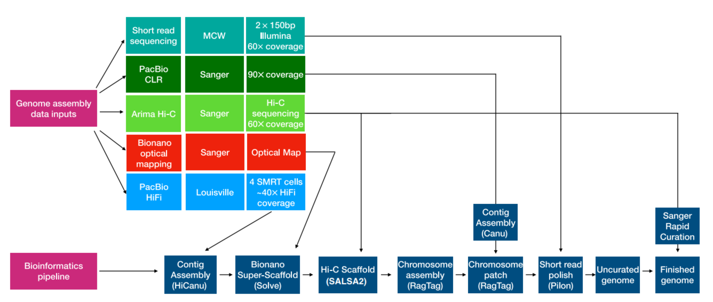

## 論文情報

**Construction and evaluation of a new rat reference genome assembly, GRCr8, from long reads and long-range scaffolding**  
Kai Li, Melissa L. Smith, J. Chris Blazier, et al.  
*Genome Research*, 2024, Vol. 34: 2081–2093  
https://doi.org/10.1101/gr.279292.124  
Copyright: CC BY-NC 4.0

---

## 背景と目的

Rattus norvegicus（実験用ラット）は、行動・生理・薬理など幅広い分野で用いられる主要なモデル動物である。  
参照ゲノムはBN/NHsdMcwiを基盤にアップデートされてきたが、現行の参照**mRatBN7.2**（2020、主にPacBio CLRで構築）には次の課題が残っていた。

- 近交系BNラットを偽二倍体として処理したことによる誤ったハプロタイプ分離  
- 反復配列（rDNA, centromere, Y染色体など）の欠落  
- CLRの高エラー率により発生した偽SNP  

> [!NOTE]
> BN/NHsdMcwi  
> Brown Norway系統の一つで、実験用ラットとして広く利用されている近交系。  
> Brown Norway系統（BN）をHarlan Sprague Dawley（Hsd）が取り扱い、ウィスコンシン医科大学（Mcwi）で維持されているサブコロニー。  
> [過排卵処理(PMSG・hCG投与)しても1匹当たり平均して2.2個しか排卵しない](https://pmc.ncbi.nlm.nih.gov/articles/PMC5081740/)ので、生殖工学技術に対する適応に難あり😓  


> [!NOTE]
> 偽二倍体（pseudo-diploid）  
> 近交系などで実質的に同一配列であるにもかかわらず、二倍体としてアセンブリされてしまう現象。PacBio CLRの高エラー率のために、非常に似た重複領域（segmental duplication）が、誤って「異なるアレル」とみなされたことによって、一方のコピーは 「primary assembly（主ハプロタイプ）」、もう一方は 「alternate assembly（代替ハプロタイプ）」 として分離されてしまう。その結果、**片方が主配列から落とされる（喪失する）**という事態が発生。大問題。  

そこで著者らは**PacBio HiFi＋ 光学マッピング＋ Hi-C**を組み合わせ、  
精度・完全性・構造連続性を大きく引き上げた新しい参照ゲノム**GRCr8**を構築した。


> [!NOTE]
> ENSEMBLEでは[release-114](https://ftp.ensembl.org/pub/release-114/fasta/rattus_norvegicus/dna/)からGRCr8が利用可能。  
> UCSC Genome BrowserおよびGGGenomeでは、2025/11/29現在は未対応。

---

## 結果

## Assembly



Fig.1に示すパイプラインで、次の手順を踏んだ。

1. **HiCanuによるHiFi de novo assembly**  
2. 光学マップ（Bionano）によるハイブリッドスキャフォールディング  
3. **Hi-C（SALSA2）による構造補正**  
4. mRatBN7.2をテンプレートとした**染色体組み立て（RagTag）**  
5. PacBio CLRでgap filling  
6. Illumina（Pilon）によるpolishing


**主なアセンブリ指標：**

- **総サイズ2.8496 Gb（98.7% が染色体配置）**  
- **Scaffold N50 = 137 Mb（染色体スケール）**  
- BUSCO（Glires）**99.7% 完全**
- Merqury解析で**QV=59.5（誤り率 ≈ 1.1×10⁻⁶）**  

> [!NOTE]
> BUSCO: Benchmarking Universal Single-Copy Orthologs
> 哺乳類なら必ず1コピーあるはずの「保存遺伝子セット」の網羅率を測る指標.

> [!NOTE]
> Merqury QV  
> アセンブリの塩基精度をk-merベースで評価する指標。
> QV: 品質値（Quality Value）であり、数値が高いほどエラー率が低い。
> ```math
> QV = -10 \times \log_{10}\!\left( \mathrm{error\_rate} \right)
>```
> 上の定義式から、エラー率は以下のように求められる。
> ```math
> \mathrm{error\_rate}
>   = 10^{-\,QV/10}
> ```
> よって、GRCr8のQV=59.5からエラー率を計算すると、
> ```math
> \mathrm{error\_rate}
>   \approx 10^{-\frac{59.5}{10}}
>   = 10^{-5.95}
>   \approx 1.1 \times 10^{-6}
> ```
> つまり、**1 Mbあたり約1.1箇所の塩基エラー**に相当する。


X軸はHiFiリードの中に含まれるk-merの出現回数（k=21）、Y軸はk-merの数を示す。  
HiFiリードは40×でシークエンスされているので、一倍体なら、

- 40×付近に autosome の巨大ピーク
- 20×付近に sex chromosome（X/Y 1コピー）由来の小ピーク

が見られる。  

Fig.2はまさにそのようなピークになっているため、BN/NHsdMcwiが**高度に近交化した「実質1倍体系統」**であることが確認され、  
mRatBN7.2で見られたような**PacBio CLR のエラーをヘテロ接合と誤認してハプロタイプが分離されてしまう現象（偽ハプロタイプ分離）**が、本来は起きるべきではなかったことを示している。

> [!NOTE]
> K-mer解析については、  
> [こちらの論文](https://www.nature.com/articles/s41467-020-14998-3)のFig.1が参考になる。

## Identification of new components of the assembly  

反復領域の回収が大きく進み、特に次の領域が改善された（Table 3, Fig.3-5）。

- **Chr3, 11, 12のrDNAクラスター領域**  
- **Chr19の巨大重複領域（>15 Mb）**  
- **ChrYヘテロクロマチン（18 Mb→59 Mbに拡張）**


## The pseudoautosomal regions of the sex chromosomes  

ヒトではX-Y間に多数のPAR遺伝子が存在するが、ネズミ科では多くが失われている。  
著者らはヒトPARの16遺伝子がラットゲノム上のどこに存在するかを調査した（Table 5）。  

結果：

- **12遺伝子：常染色体に再配置**  
- **4遺伝子：完全消失**  
- **X-Y間の真正のPARは存在せず**

→ ラットは**PARがほぼ完全に退化した哺乳類**であり、  
X-Y間組換えは限定的である可能性が高い。

> [!NOTE]
> マウスとラットでは残存するPAR遺伝子の組み合わせが異なり、その点が興味深い。


## Gene annotation

NCBI RefSeqは約100億本のショートリードと約3,500万本のロングリードを用い、タンパク質コード遺伝子の約8割にキュレート済みRefSeq転写産物（NM_）を割り当てた。

その結果、新たに以下の遺伝子が同定された。

- **780個の「unmapped gene」**（mRatBN7.2では位置不明）  
- **373個の「novel gene」**（既存領域にあったが未注釈）

GRCr8で新たに同定されたChr19の領域では、14〜30 Mbに相同配列のリピートが広がり、雄特異的で性染色体ドライブに関与する**Speer類似遺伝子群**が多数存在することがFig.5で示された。


## Base-level assembly accuracy

mRatBN7.2では近交系ラットの複数系統で**129,000箇所のSNPが共通に検出**されており、CLRの高エラー率に起因する**偽変異**とみなされた。  
GRCr8ではそれが**550**にまで減少し、誤った変異がほぼ取り除かれた。

---

# 議論

GRCr8はmRatBN7.2に比べ、次の点で本質的に向上している。

- **1倍体系統として構築**  (Fig.2)
- 反復領域（rDNA, centromere, telomere, Y染色体）の正確な同定   (Fig.3-4)
- 性染色体ドライブ関連の多コピー遺伝子群の検出  (Fig.5)
- 大規模欠落が消失
- 「偽変異」が激減

---

## 限界と今後の展望

**限界**

- Telomere-to-telomere（T2T）には未到達  
- 特にrDNAクラスター・巨大衛星配列はHiFiでも完全解決は困難  
- 一部のギャップはCLRで埋めており、完全精度ではない可能性

**今後の展望**

- Nanoporeシークエンスなどより長いリードを組み合わせたT2Tアセンブリ  
- 近交系ラット（SHR、F344など）の高精度ゲノム整備  

---

## 読後の感想

最近、「KOnezumi」の多種実験動物版「KOzoo」を滝大斗さんが行ってくれている関係で、私もマウス以外のゲノムアノテーションに触れる機会が増えました。  
とくに近縁のラット対応は重要な課題だと思っており、今回のGRCr8のリリース論文は非常に興味深かったです。

ENSEMBLEのGTFで確認したところでは、mRatBN7.2では転写産物アノテーション数がマウスの約4分の3にとどまり、  
実際の転写産物数を十分に反映しきれていない印象を受けました。  
GRCr8はENSEMBLで既に利用可能で、GTFも公開されているので、どの程度改善されているのか楽しみです😋  

なお、UCSC Genome Browserはデフォルトで2014年のrn6（RGSC 6.0）が設定されていて、だいぶ古いです。  
rn7（mRatBN7.2）も選択可能ですが、rn6に比べてカスタムトラックがかなり少ない状況です。  
そういった状況なので、GRCr8対応はいつになるのか…

蛇足ながら、Markdownで数式を書く際は$$ ... $$またはmath ... で囲む方法がありますが、  
個人的にはmath ... の方が扱いやすいと感じています。  
$$記法では改行が崩れやすいため、注意が必要です。
