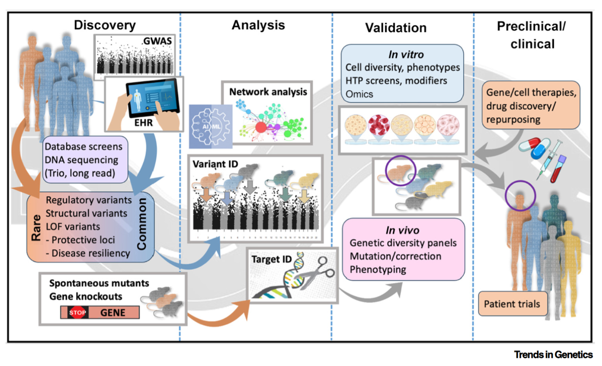

## 論文情報

**The rare-to-common disease journey: a winding road to new therapies**
Laura Reinholdt, Elissa Chesler, Martin Pera, Nadia Rosenthal
*Trends in Genetics*, 2025, Vol. 41, No. 9, 762-773
https://doi.org/10.1016/j.tig.2025.05.003
Copyright: [CC BY 4.0](http://creativecommons.org/licenses/by/4.0/)

:::important
下記は久野（人間）が文章を書き、AIが校正しました。  
内容の質についてはすべて久野に責任があります。  
:::

---

## The case for studying rare diseases（希少疾患を研究する意義）**
希少疾患は人口のわずかな割合にしか影響を与えませんが、その約80%が遺伝に起因しており、多くは小児期に発症します。希少疾患の研究は、経済的インセンティブの欠如などの課題がある一方で、**原因が単一の遺伝子（モノジェニック）であることが多く、病気の根本原因を特定しやすい**という利点があります。アンチセンスオリゴヌクレオチドや遺伝子編集などの技術進歩により、これら希少疾患向けの個別化医療の開発が加速しています。

## The common disease conundrum（一般的な病気の難問）
一般的な病気（コモンディジーズ）は、単一の遺伝子ではなく、多数の遺伝子や経路が複雑に絡み合って発症するため、治療標的を見つけるのが困難です。そのため、希少疾患の原因となる明確な遺伝子変異を出発点とし、一般的な病気の背後にある共通の病理メカニズムを解き明かす**「希少疾患から一般的な病気へ（rare-to-common）」**というアプローチへの転換が注目されています。

## Rare-to-common disease translation: bumps in the road（応用への道のりにある障害）**

希少疾患で得られた知見を一般的な病気の治療に翻訳することは、一筋縄ではいきません。本論文では以下の3つの仮説（Postulate）を通してその関連性を考察しています。
*   **Postulate 1:** 希少疾患の遺伝子は進化的に古く、生存に不可欠な機能（ハウスキーピング機能）や複雑なネットワークを持つ傾向があります。AIによるネットワーク解析やマウスモデルのデータを活用することで、これら希少疾患の遺伝子を研究することが一般的な病気のメカニズム解明に繋がります。
*   **Postulate 2:** 同じ疾患原因変異を持っていても、**患者ごとの「遺伝的背景（別の二次的な変異など）」が病気の進行や症状の重さに大きく影響**します。この遺伝的背景を理解することは、希少疾患の診断だけでなく、拡張型心筋症などの一般的な病気における発症のばらつきを説明する上でも不可欠です。
*   **Postulate 3:** 一般的な病気の患者と希少疾患の患者は、原因となる変異が異なっていても、**結果的に同じ細胞ネットワークや生化学的経路の障害を共有している**ことが多く、共通の治療アプローチが有効になる可能性があります。

## Rare protection from common disease（一般的な病気から身を守る希少な変異）**
一般集団の中から、特定の一般的な病気に対して**「保護的な効果」をもたらす、まれな機能喪失型（LOF）変異**が見つかることがあります。例えば、高コレステロールに対して自然な耐性をもたらす「PCSK9遺伝子」の発見は、強力なコレステロール低下薬の開発に繋がりました。このような有益な変異を模倣することは、一般的な新薬開発の優れた標的となります。

## Progress down the path to therapeutics（治療薬開発への道筋と課題）
このアプローチを臨床治療へと進めるには、いくつかの進歩が必要です (図1)。
1.  **非コード領域の理解:** ゲノム上の非コード領域（タンパク質を作らない領域）にある変異の働きを解明すること。
2.  **細胞レベルでの解析:** 単一細胞解析やオルガノイドを用いて、特定の細胞タイプにおける変異の影響を評価すること。
3.  **モデル生物の改善:** 個人の遺伝的多様性を反映させたマウスモデルなどを活用し、ヒトの複雑な遺伝的背景を再現すること。
4.  **安全なデリバリー技術:** 遺伝子治療を少数の希少疾患患者だけでなく、一般的な病気を持つ何百万人もの患者に安全かつ安価に届けるため、脂質ナノ粒子（LNP）などの新しい送達技術を応用すること。

## Concluding remarks（結論）**
個人の遺伝的背景を考慮せずに一般的な病気をひとまとめにする従来のアプローチには限界があります。希少疾患から得られた「遺伝的変異がどのようにネットワークを乱すか」という知識を活用し、病気表面の症状ではなく**共通する根本的な病理（メカニズム）を標的とした治療へとシフトしていくこと**が、今後の医療における重要な方向性となります。

---

## 読後感

### 論文の価値

DeepPhenoというモデル名ですが、それほど**Deep**ではありません。  
深層学習そのものというより、むしろ本論文の価値は、

**オントロジーをどのようにモデルに組み込むか**

という設計にあると感じました。

また、

- 問題設定が明確である
- 評価が丁寧である
- 応用可能性まで示している

という点で、論文として非常に勉強になりました。

### 不明な点

一方で、なぜLoF（loss of function）に焦点を当てているのかは、十分に理解できませんでした。  
Discussionには`Specifically, it is designed to predict phenotypes which arise from a loss of function (where functions are represented using the Gene Ontology)`とありますが、手法の枠組み自体は、必ずしもLoFに限定されるものではないように思えます。  

もしLoFに焦点を当てるのであれば、IMPCのデータセットで検証していてもよいはずですが、その点に関する評価がないのも気になりました。  
入力がGOと遺伝子発現である以上、IMPCのデータセットを用いても、直ちに情報リークの問題が生じるようには思えません。  

もっとも、DeepPhenoの出力はHPOである一方、IMPC側ではMPが用いられるため、出力先オントロジーの違いをどう整合させるかが難しく、その点が検証を行っていない理由なのかもしれません。  
