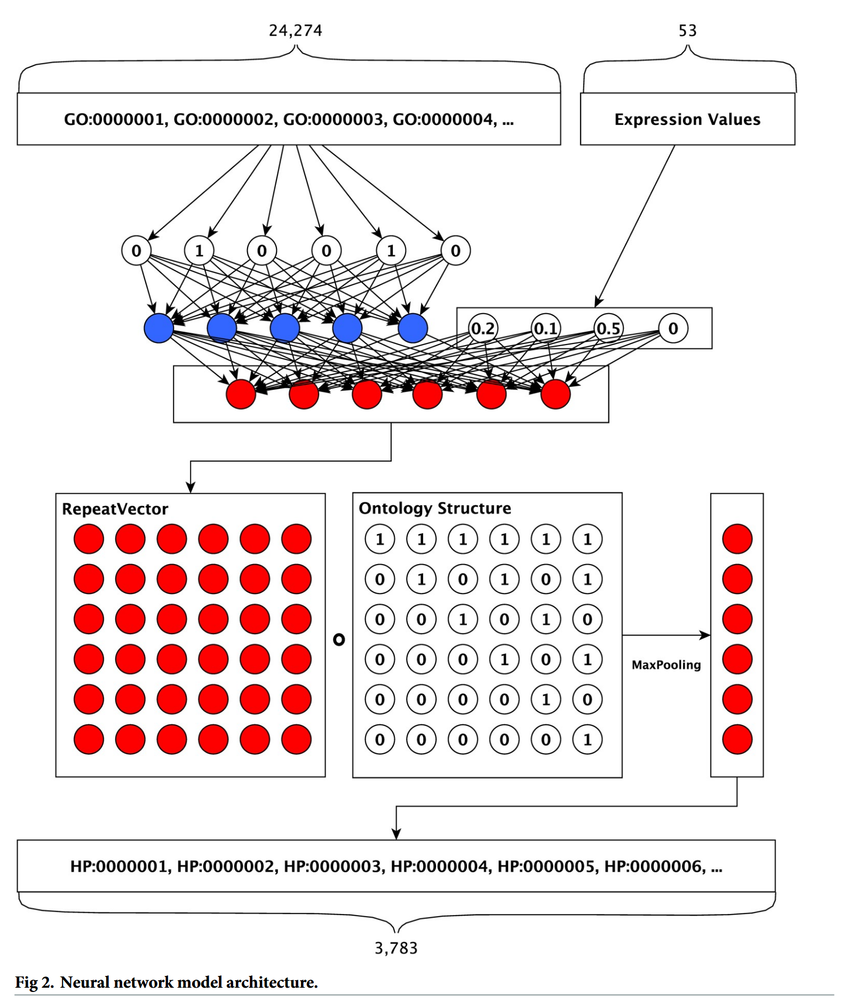

## 論文情報

**DeepPheno: Predicting single gene loss-of-function phenotypes using an ontology-aware hierarchical classifier**  
Maxat Kulmanov, Robert Hoehndorf  
*PLOS Computational Biology*, 2020, Vol. 16, Issue 11, e1008453  
https://doi.org/10.1371/journal.pcbi.1008453  
Copyright: [CC BY 4.0](https://creativecommons.org/licenses/by/4.0/)  

---

## 背景と目的

- 個体レベルの表現型と遺伝子機能の因果関係を特定することは遺伝学における重要課題である  
- これまでノックアウトマウスなどの動物モデルを使った実験が用いられているが、非常に時間がかかり高コストである上、ヒトで直接実験することは倫理的に不可能  

- そこで、コンピュータによる予測モデルを作る上で、遺伝子の機能（Gene Ontology: GO）から表現型（Human Phenotype Ontology: HPO）を予測するアプローチが有効
- ただ、以下のような欠点もある
  - すべての遺伝子に実験的な機能アノテーションが付与されているわけではないというデータの欠落が課題
  - 予測する表現型オントロジーは複雑な階層構造を持っており、これを整合性を保ちながら機械学習で予測することは技術的に困難

- そこで著者らは**単一遺伝子の機能喪失(LoF)時に生じる表現型を予測する機械学習モデル「DeepPheno」を開発した**
  - DeepPhenoは遺伝子の機能アノテーション（GO）と遺伝子発現量データを入力として、その遺伝子のLoFによって生じうるHPO（Human Phyenotype Ontology）を出力する
  - オントロジー構造をニューラルネットワークの計算に直接組み込む「階層的分類レイヤー」を新たに設計し、階層的に矛盾のない高精度な予測を実現した
  - さらに、アミノ酸配列から機能を予測するツール（DeepGOPlus）を組み込むことで、実験データがない遺伝子の機能を補完し、既知のあらゆるタンパク質コード遺伝子に対して表現型予測を可能にした

---

## DeepPhenoの構造 (Fig. 2, 3)

### 1. 入力層

各遺伝子において、その遺伝子が持つ遺伝子機能アノテーション（GO）の二値ベクトル（あり・なし）および遺伝子発現ベクトルを入力として受け取ります。  

- GOは24,274次元
- 遺伝子発現は53次元

:::note
遺伝子発現の53次元は、[GTEx](https://www.ebi.ac.uk/gxa/experiments/E-GTEX-8/Results)の53組織の遺伝子発現アノテーションから得られています。
:::

### 2. 全結合層

GOの二値ベクトルは全結合層に渡されて次元圧縮を受けた後に、遺伝子発現ベクトルと結合します。  

その後、予測対象となる表現型（HPO）と同じユニット数に設計された全結合層に渡します。  

### 3. 階層的分類層

**この層がDeepPhenoの最大の特徴**で、第2層の出力ベクトル（シグモイド出力）に対して、HPOのサブクラス（親子）関係をエンコードした二値行列を掛け合わせます。  

Fig.3は行列の積の具体例が図示されています。

まず全結合層で得られたベクトルをHPOの行列の行数分リピートします。  

HPOの行列は、階層構造を二値化したものです。  
各列がそれぞれの用語のもつ親と自分自身を二値化したもので、例えばHPO行列一番右の`[1,0,1,0,0,1]`という列は6番目のノードの親と自分自身（1,3,6）に`1`を付与しています。  

この2つの行列の積を取り、行ごとの最大値を取ったものが、出力のベクトル`[0.6,0.3,0.6,0.1,0.2,0.6]`になります。  
それぞれの値が、その遺伝子のLoFがそれぞれのHPOを持つのかを表す予測値となります。  

---

### 性能評価 (Fig. 1)

[CAFA2](https://arxiv.org/abs/1601.00891)で上位を得た手法との性能比較です。  

DeepPhenoは既存の手法より優れた結果を得ました。

:::note
[CAFA（Computational Assessment of Function Annotation](https://biofunctionprediction.org/cafa/):  
タンパク質の機能や表現型を予測する計算モデルの性能を評価・比較するための、大規模な国際的コンペティション  
:::

:::caution
Naiveは、遺伝子の特徴を一切見ず、学習データ内で「最も頻繁に出現する表現型」をすべての遺伝子に対して一律で予測する手法で、ベースラインです。  
つまり、「常に一番多い答えを出す」という単純な戦略です。  
Fig. 1ではほとんどの手法はベースラインを超えることができていないのですが、論文のこれは`Fmax`に依存しています。  
Fmaxは、すべての表現型（クラス）の正解を平等に扱います。そのため、Naive手法は、「頻出する一般的なクラス（例：細胞内小器官（organelle））」をすべての遺伝子に対して予測するため、「True Positive（真陽性）」の数を稼ぎやすく、**Fmaxのスコアが不当に押し上げられます**。  
感度・特異度の両方を考慮するAUCでは、他の手法がNativeより優れていることが[CAFE2論文のFig5](https://ar5iv.labs.arxiv.org/html/1601.00891#:~:text=the%20Skin%20Physiology%E2%80%9D.-,Figure%205,-%3A)で示されています。
:::

### 読後感

**Deepではない**です。  
むしろHPOを扱えるように層を工夫したほうが強いので、ちょっと名前との乖離を感じました。  
深層学習がバイオインフォマティクスの中で流行り始めていた時代（2020年出版）なので、とりあえずDeepをつけてたほうが目に入りやすい、という気持ちはわかる気がします。  

