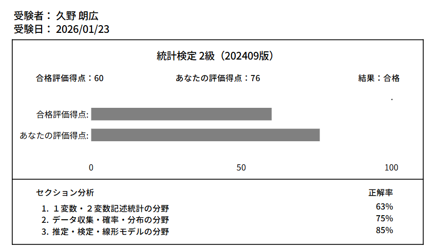
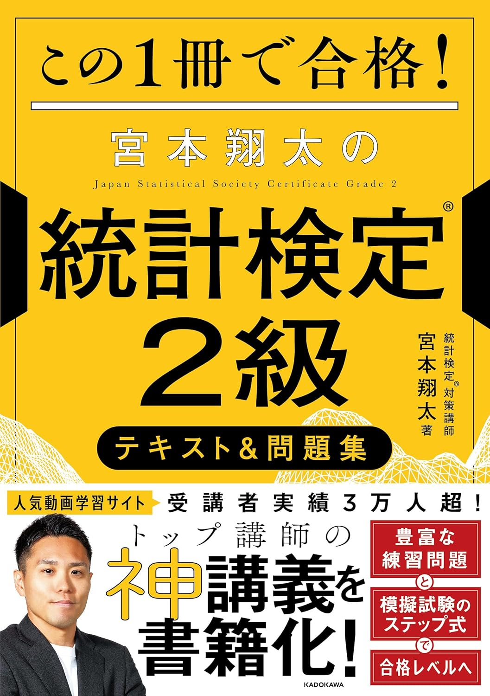

昨日（2026年1月23日）、統計検定2級を受験し、76点で合格しました。

目標としていた80点には届かず、率直に言って悔しい気持ちです。  
しかしながら、多くの学びがあったため、振り返りとして記録を残します。

## 受験の動機

バイオインフォマティクスを専門として研究を行っていることもあり、研究室では「どの検定を使えばよいでしょうか？」といった質問を受ける機会が少なくありません。

一方で、私自身の統計学の学習はこれまで完全に独学であり、体系的に理解しているとは言い難い状況でした。そのため、一度きちんと整理して学び直す必要性を感じたことが、受験のきっかけです。

当初は統計検定準1級の受験も検討しましたが、過去問を見てほとんど歯が立たなかったため、まずは2級から取り組むことにしました。

結果として、この判断は正解だったと感じています。  
冒頭で触れた「どの検定を使うとよいか」という問いに対して、実務レベルで説明できる力を与えてくれるのが、まさに2級だと思います。

総じて、統計検定2級は、**実務で重要となる統計の勘所を学べる**試験だと思います。

## 学習時間

日記によると、**12月7日**から学習を開始し、**36日間**取り組んでいました。  
1回あたりの学習時間はおおよそ1時間程度だったため、
単純計算で総学習時間は**約36時間**です。

## 学習教材

**この1冊で合格! 宮本翔太の統計検定(R)2級 テキスト&問題集**  

統計検定2級のCBTの過去問を始めに手を付けたのですが解説がほとんど理解できず、早々に断念しました。  
その後は、この書籍1冊に集中して取り組みました。

これまで断片的に学んでいた統計の知識が、ストーリーとして有機的につながっていく感覚があり、非常に有意義でした。

過去問に手を出す前に、まずこの書籍を一通り読み切ることを強くおすすめします。

統計検定2級の合格（60点以上）であれば、この書籍を繰り返し読み、内容を定着させることで、十分に達成可能だと思います。

補助的な教材として、空き時間に定番の「とけたろう」さんや「データサイエンスラボ」さんのYouTube動画も視聴しました。  
とくに重回帰分析など、2級の中でも理解負荷の高い分野については、動画による解説が理解の助けになりました。

その後に改めて過去問に取り組み、「おおよそ解ける」と感じた段階で本番に臨みました。

## 試験中

試験開始後、最初の5分で全32問の概要を把握しました。  
内訳としては、記述統計が約10問、確率および確率モデルが約12問、残りが推定・検定・線形モデルといった形でした。

意外だったのは、**計算がかなり少なかった**ことです。  
たとえば母比率の差の検定では、通常は統計量を求めるのにそれなりの計算が必要なのですが、本番の試験では統計量の計算結果があらかじめ問題文に与えられていました。

:::caution
試験では最初に配布されるメモ用紙が2枚のみで、表面にしか記入できません。  
実際、本番では早々に足りなくなったのですが、メモ用紙の追加は1枚ずつしか許されず、不便に感じました。  
さらにボールペンのインクの出がかなり悪いという、なかなか厳しい条件でした。  
全国的にこうした状況が多いので、計算問題を少なくしているのでは…と邪推してしまいました😅
:::

その代わりに、より横断的な理解が求められていたと思います。  
印象に残った問題として、以下に類似した問題が出題されました。

> ある工場の機械が1日平均36回故障するとする。この故障回数はポアソン分布*Possion(36)*に従う。1日の故障回数が30回以上42回以下となる確率を正規近似（連続性の修正を含む）を用いて求めよ。小数第4位まで求めよ。
> https://app.statisticsschool.com/practice/statistics-applied/probability-and-distributions/#probability-and-distributions-017

本番は、もう少し簡単な設問でしたが、一つの単元を理解するだけでは対応できない問題が多かった印象です。

## 試験後の感想

「理解があと一歩足りていない」と感じました。

単元ごとにまとまった内容については、ほぼ問題なく解くことができました。

2級の難所と言われる「推定・検定」の分野は、試験内容はテキストの通りであり、計算量も少なかったため、むしろ自信を持って解答できました。

一方で、記述統計や確率・確率分布の分野では、先ほどのポアソン分布の例のように、分布同士を横断的に捉える理解が必要であり、より基礎的な概念理解が必要だと強く感じています。

## これから

もともと統計検定準1級を目標としているため、今後も学習を継続します。  
準1級では微積分と線形代数の知識が不可欠になるため、基礎から学び直し、1年後の受験を目標に進める予定です。

資格試験は、教養の幅を広げるだけでなく、生涯学習の一環としても非常に有意義だと感じています。  
今後も無理のないペースで続けていきたいと思います。
