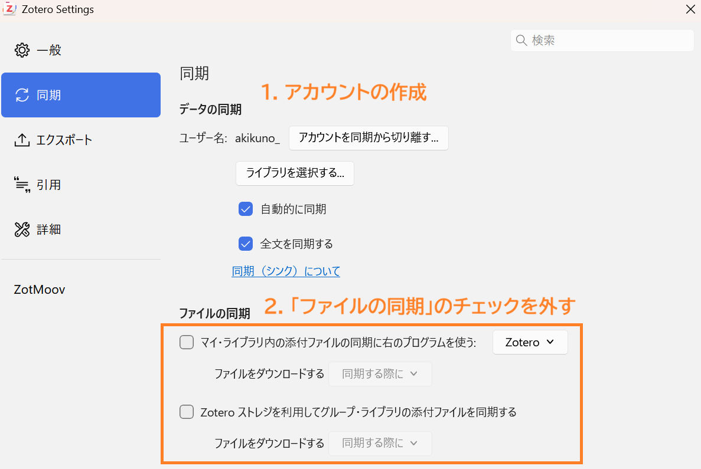
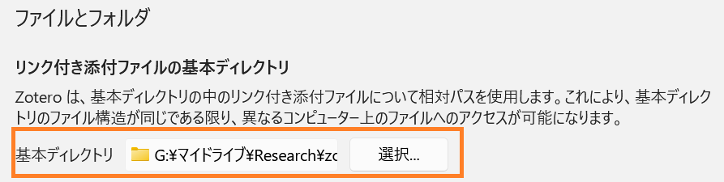
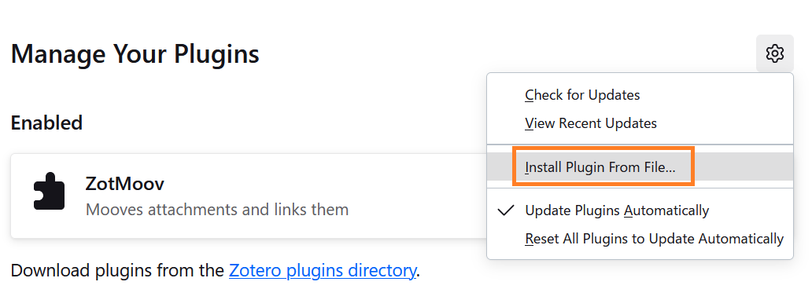
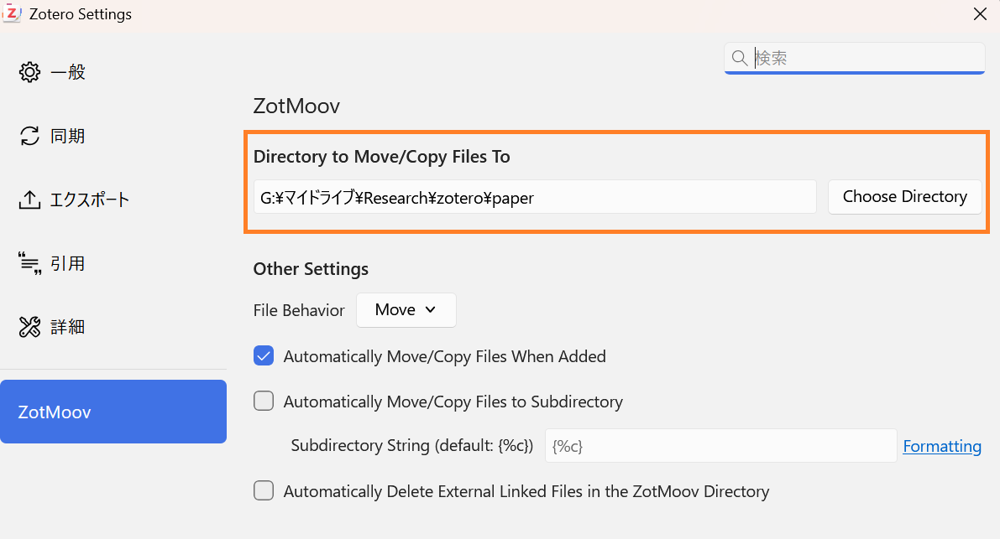

## はじめに

先月、[Zotero 8がリリースされました](https://www.zotero.org/blog/zotero-8/)。  
本記事では、Zotero 8を用いて複数PC間で論文PDFを同期する方法を解説します。  

Zoteroのクラウドストレージは無料枠が300MBと小さいため、Google Driveなどのクラウドストレージを併用して容量制限を回避します。  

本記事のゴールは以下の通りです：

1. Zoteroに論文PDFをインポートする  
2. PDFが自動的にクラウドストレージに保存される  
3. 別のPCからも同じPDFを開ける！🎊  


## 1. Zoteroアカウントの作成

「編集」→「設定」→「同期」を開き、Zoteroアカウントを作成します。

次に、**「ファイルの同期」のチェックボックスを両方とも外します。**

:::important
この設定により、Zoteroのクラウドストレージ（300MB）の使用を回避できます。  
:::




## 2. 「リンク付き添付ファイルの基本ディレクトリ」の設定

「編集」→「設定」→「詳細」を開き、「リンク付き添付ファイルの基本ディレクトリ」をクラウドストレージ上の論文保存フォルダに設定します。




:::note
この設定は、リンク付き添付ファイルを**相対パスで管理するための基準フォルダ**を指定するものです。  

例えば、基本ディレクトリを

```
D:/zotero/paper/
```

に設定すると、Zoteroは

```
CRISPR/base_editor.pdf
```

のような相対パスでPDFを管理します。

そのため、他のPCでは基本ディレクトリのパスが異なっていても（例：E:/zotero/paper/）、リンク切れが発生しません。

この設定により**複数PC間で同じPDFを問題なく参照できる**ようになります。
:::

## 3. ZotMoovの設定

Zotero 6までは、`ZotFile`というプラグインで以下を自動化していました：

- ファイル名変更  
- 指定フォルダへの移動  

Zotero 8では、**[ファイル名変更は標準機能として自動化されるようになりました](https://www.zotero.org/support/file_renaming)🎊**

しかし、PDFを指定フォルダへ移動することはできないため、そのためのプラグインとして、`ZotMoov`を使用します。

:::note
`ZotFile`は2022年以降更新されておらず、Zotero 7以降では使用できません。  
https://github.com/jlegewie/zotfile/releases
:::


### インストール

以下からZotMoovの最新バージョン（Latest）の`xpi`ファイルをダウンロードします：  
https://github.com/wileyyugioh/zotmoov/releases

次に、Zoteroの

「ツール」→「プラグイン」→「Install Plugin from file...」

を開き、ダウンロードしたファイルをインストールします。




### ZotMoovの設定

「編集」→「設定」→「ZotMoov」を開き、

「Directory to Move/Copy Files to」

に、**手順2で設定したフォルダ**を指定します。




これで、論文PDFをZoteroに追加すると、自動的にクラウドストレージ内のフォルダへ保存されます。

同様の設定を別のPCでも行うことで、複数PC間で同じPDFを参照できるようになります。


## まとめ

Zotero 8とクラウドストレージを組み合わせることで、

- Zoteroの容量制限を回避できる  
- PDFを自動整理できる  
- 複数PC間で論文を安全に同期できる  

ようになります。

## 雑談

Zotero 6まではZoteroをメインで使っていたのですが、Zotero 7で大幅にUIが変わった事と、Paperpileが人気になっていたこともあって、ここ数年はPaperpileを使っていました。

ただ、PaperpileはWebアプリのためちょっとモッサリ感があるのと、少しですが課金があるので、Zoteroに戻ろうか、と思っていた矢先にZoter 8が出たので、これを気に再び使ってみることにしました。

今年はZotero 8で快適な論文読み書き生活を送りたいです😁
