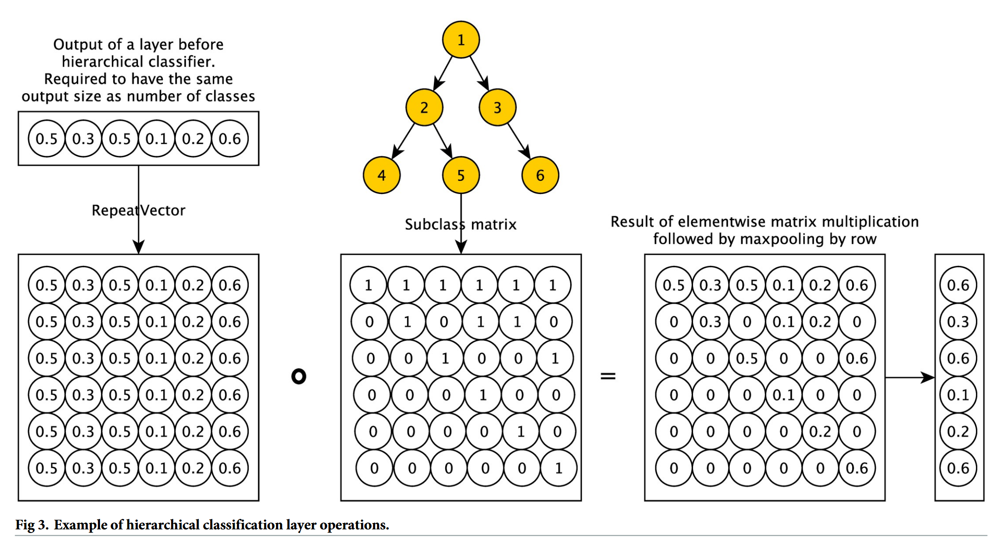
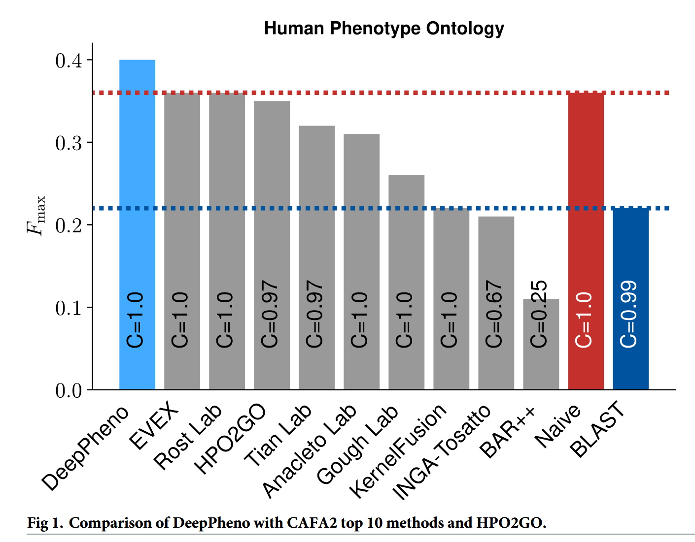
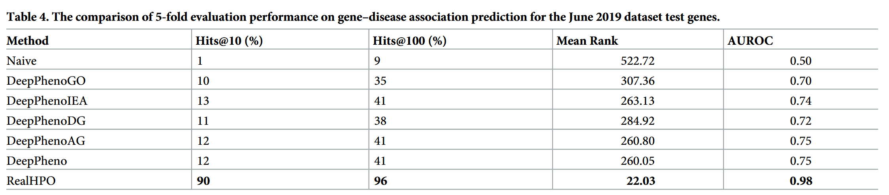

## 論文情報

**DeepPheno: Predicting single gene loss-of-function phenotypes using an ontology-aware hierarchical classifier**  
Maxat Kulmanov, Robert Hoehndorf  
*PLOS Computational Biology*, 2020, Vol. 16, Issue 11, e1008453  
https://doi.org/10.1371/journal.pcbi.1008453  
Copyright: [CC BY 4.0](https://creativecommons.org/licenses/by/4.0/)

---

## 背景と目的

- 個体レベルの表現型と遺伝子機能の因果関係を特定することは、遺伝学における重要課題である。  
- これまでノックアウトマウスなどの動物モデルを用いた実験が行われてきたが、非常に時間とコストを要し、ヒトで直接実験することは倫理的に不可能である。  

- そこで、コンピュータによる予測モデルを構築する上で、遺伝子の機能（Gene Ontology: GO）から表現型（Human Phenotype Ontology: HPO）を予測するアプローチが有効である。  
- ただし、以下のような課題もある。  
  - すべての遺伝子に実験的な機能アノテーションが付与されているわけではなく、データ欠損が問題となる。  
  - 予測対象である表現型オントロジーは複雑な階層構造を持つため、整合性を保ちながら機械学習で予測することは技術的に困難である。  

- そこで著者らは、 **単一遺伝子の機能喪失（LoF）時に生じる表現型を予測する機械学習モデル「DeepPheno」** を開発した。  
  - DeepPhenoは、遺伝子の機能アノテーション（GO）と遺伝子発現量データを入力とし、その遺伝子のLoFによって生じうるHPO（Human Phenotype Ontology）を出力する。  
  - オントロジー構造をニューラルネットワークの計算に直接組み込む「階層的分類レイヤー」を新たに設計し、階層的に矛盾のない高精度な予測を実現した。  
  - さらに、アミノ酸配列から機能を予測するツール（DeepGOPlus）を組み込むことで、実験データがない遺伝子の機能を補完し、既知のあらゆるタンパク質コード遺伝子に対して表現型予測を可能にした。  

---

## 手法

### DeepPhenoの構造（Fig. 2, 3）

<!--  -->

#### 1. 入力層

各遺伝子について、その遺伝子が持つ遺伝子機能アノテーション（GO）の二値ベクトル（あり・なし）および遺伝子発現ベクトルを入力として受け取る。  

- GOは24,274次元
- 遺伝子発現は53次元

:::note
遺伝子発現の53次元は、[GTEx](https://www.ebi.ac.uk/gxa/experiments/E-GTEX-8/Results)の53組織の遺伝子発現アノテーションから得られている。
:::

#### 2. 全結合層

GOの二値ベクトルは全結合層に渡されて次元圧縮を受けた後、遺伝子発現ベクトルと結合される。  

その後、予測対象となる表現型（HPO）と同じユニット数に設計された全結合層に渡される。  

#### 3. 階層的分類層

<!--  -->

**この層がDeepPhenoの最大の特徴**であり、第2層の出力ベクトル（シグモイド出力）に対して、HPOのサブクラス（親子）関係をエンコードした二値行列を掛け合わせる。  

Fig. 3では、行列積の具体例が図示されている。  

まず、全結合層で得られたベクトルをHPOの行列の行数分リピートする。  

HPOの行列は、階層構造を二値化したものである。  
各列はそれぞれの用語が持つ親と自分自身を二値化したものであり、例えばHPO行列の一番右の`[1,0,1,0,0,1]`という列は、6番目のノードの親と自分自身（1,3,6）に`1`を付与している。  

この2つの行列の積を取り、行ごとの最大値を取ったものが、出力ベクトル`[0.6,0.3,0.6,0.1,0.2,0.6]`となる。  
それぞれの値が、その遺伝子のLoFが各HPOを持つかどうかを表す予測値となる。  

---

## 結果

### DeepPhenoの性能評価（Fig. 1）

<!--  -->

タンパク質の機能や表現型を予測する計算モデルの性能を評価・比較するための大規模な国際的コンペティション[CAFA2](https://arxiv.org/abs/1601.00891)で上位を得た手法と、DeepPhenoの性能比較である。  

DeepPhenoは、表現型予測において既存手法より優れた結果を示した。  

:::caution
Naiveは、遺伝子の特徴を一切見ず、学習データ内で「最も頻繁に出現する表現型」をすべての遺伝子に対して一律に予測するベースライン手法である。  
つまり、「常に一番多い答えを出す」という単純な戦略である。  
Fig. 1ではほとんどの手法がこのベースラインを超えられていないが、これは`Fmax`に依存している。  
Fmaxは、すべての表現型（クラス）の正解を平等に扱う。そのため、Naive手法は「頻出する一般的なクラス（例：細胞内小器官（organelle））」をすべての遺伝子に対して予測することで、True Positive（真陽性）の数を稼ぎやすく、**Fmaxのスコアが不当に押し上げられる**。  
一方、感度と特異度の両方を考慮するAUCでは、他の手法がNaiveより優れていることが[CAFA2論文のFig. 5](https://ar5iv.labs.arxiv.org/html/1601.00891#:~:text=the%20Skin%20Physiology%E2%80%9D.-,Figure%205,-%3A)で示されている。
:::

:::note
毎回、Precision（適合率）とRecall（再現率）が覚えられないのでメモ：  
$Precision = TP/(TP+FP)$  
$Recall = TP/(TP+FN)$  

分子はいずれも「正の予測が合っていた数」であり、分母が異なる。  
Precisionは**正と予測したデータ**を分母に取り、Recallは**実際に正であるデータ**を分母に取る。  
したがって、  
- Precision = Predict（予測）  
- Recall = Real（実際）  
というように、分母と関連付けて覚えると整理しやすい。
:::

### 疾患原因遺伝子の推定（Table 4）

DeepPhenoが予測した表現型アノテーションが、特定の疾患の原因遺伝子を特定するタスクに実際に役立つかどうかを検証している。  

**データセット**  
OMIM（Online Mendelian Inheritance in Man）データベースから抽出した、395遺伝子・548疾患にまたがる561件の「遺伝子−疾患対応データ」を用いて評価している。  

**予測手法**  
「遺伝子と疾患の表現型が似ていれば関連している可能性が高い」という仮説に基づき、モデルが予測した「遺伝子の表現型」と、データベース上の「疾患の表現型」との意味的類似度（Resnik＋Best-Match-Average）を計算し、各疾患に対して候補遺伝子のランキング（優先順位付け）を行っている。  

#### DeepPhenoによる予測モデル

- **DeepPhenoGO**（実験的GO機能のみ）  
  AUROC 0.70 / Hits@10 10%
- **DeepPhenoDG**（配列から予測したGO機能のみ）  
  AUROC 0.72 / Hits@10 11%
- **DeepPhenoIEA**（電子的推論GOを追加）  
  AUROC 0.74 / Hits@10 13%
- **DeepPheno完全版**（全機能情報＋遺伝子発現）  
  AUROC 0.75 / Hits@10 12% / Hits@100 41%

#### 実データ（RealHPO）

AUROC 0.98 / Hits@10 90%

実際のHPOデータベースに登録された「正解の表現型」をそのまま用いると、ほぼ完全な精度となる。  
これは、OMIMの多くが単一遺伝子疾患であり、疾患の表現型と原因遺伝子の表現型がほぼ同一として登録されているためである。  

#### 完全なベースライン（Naive）

AUROC 0.50 / Hits@10 1%

すべての遺伝子に頻出表現型を割り当てるだけのNaive手法では、遺伝子間の違いを識別できず、ランダム予測と同等（AUROC 0.50）であり、実用性はない。  

### 結果の解釈

**予測表現型の有用性**  

DeepPhenoが予測した表現型は、疾患原因遺伝子を特定するための有用な特徴量として機能することが示された。  

**配列のみからの原因遺伝子推定**  

実験的な機能情報を使わず、タンパク質のアミノ酸配列から予測した機能のみを入力としたモデル（DeepPhenoDG）でも、AUROC 0.72という高い性能を示した点は重要である。  

:::note
タンパク質のアミノ酸配列から予測するツールとして、同じ著者らが開発した[DeepGOPlus](https://academic.oup.com/bioinformatics/article/36/2/422/5539866)を用いている。
:::

結果として、  
**「機能が未解明であっても、アミノ酸配列が分かっていれば、その遺伝子が関与し得る疾患を予測できる」**  
可能性が示されており、DeepPhenoの実用性を示唆している。  

---

## 読後感

### 論文の価値

率直に言うと、モデル自体はそれほど**Deep**ではありません。  
むしろ本論文の価値は、

**オントロジーをどのように学習へ組み込むか**

という設計にあると感じました。

- 問題設定が明確である
- 評価が丁寧である
- 応用可能性まで示している

という点で、論文として非常に参考になりました。

### 不明な点

一方で、なぜLoF（loss of function）に焦点を当てているのかは、十分に理解できませんでした。  
Discussionには`Specifically, it is designed to predict phenotypes which arise from a loss of function (where functions are represented using the Gene Ontology)`とありますが、手法の枠組み自体は、必ずしもLoFに限定されるものではないように思えます。  

もしLoFに焦点を当てるのであれば、IMPCのデータセットで検証していてもよいはずですが、その点に関する評価がないのも気になりました。  
入力がGOと遺伝子発現である以上、IMPCのデータセットを用いても、直ちに情報リークの問題が生じるようには思えません。  

もっとも、DeepPhenoの出力はHPOである一方、IMPC側ではMPが用いられるため、出力先オントロジーの違いをどう整合させるかが難しく、その点が検証を行っていない理由なのかもしれません。  
